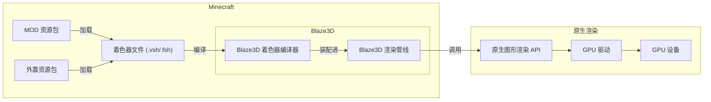
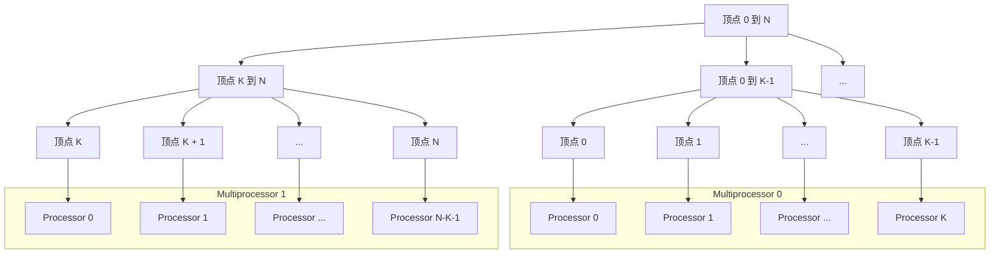
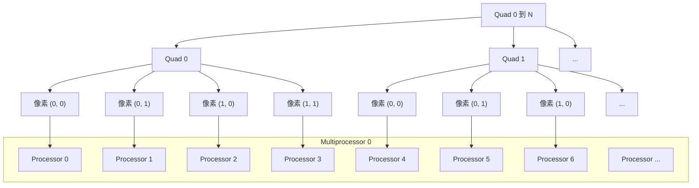

# 03.1. 基本概念

再进一步深入渲染前, 我们需要先探讨渲染中最关键的一些基本概念与前置知识, 这部分会参杂部分来自 [LearnOpenGL](https://learnopengl.com) 的内容加上我自己的理解.
如果没有看懂我的讲解, 可以前往 LearnOpenGL 本站或其 [中文翻译站点](https://learnopengl-cn.github.io/) 深入了解.

## 1. 顶点, 图元, 片段

在渲染中, 顶点 (Vertex) 通常代表着三维或二维空间中的一个点. 是定义图元的基本结构, 储存着坐标, 贴图, 颜色等一系列基本组成图元并绘图所需的属性信息.

图元 (Primitive) 是由顶点连线相连组成的基本几何图形. 最基本也是最常用的图元是三角形 (Triangle). 我们渲染的物体通常是网格模型 (Mesh), 即由顶点组成的图元进一步组成的多面体.

片段 (Fragment) 则为图元内部由顶点连线内区域的像素, 片段可以被附上颜色. 这个过程称为着色 (Shading), 根据着色时提供的参数与顶点自身的属性信息将顶点组成的网格骨架覆盖上颜色.


## 2. 标准化设备坐标系

在将图元绘制到屏幕上前, 我们需要明确的一个问题是: "我给了一个顶点, 他会渲染在窗口的哪里?" 
此时就需要通过 [标准化设备坐标系](https://learnopengl-cn.github.io/01%20Getting%20started/04%20Hello%20Triangle/) (Normalized Device Coordinates, 以下简称NDC) 来确定给定坐标点在窗口中的位置.

NDC 是图形API定义的跨平台统一的二维坐标系, 范围为`[-1.0, 1.0]`. 其原点在窗口正中央, X 轴为水平轴, 正方向为向右; Y 轴为垂直轴, 
但与通常图像坐标系不同的是, **Y轴正方向为向上而非向下**.

下图来自 [LearnOpenGL CN](https://github.com/LearnOpenGL-CN/LearnOpenGL-CN/)


如图所示, 只要我们提供了 `(0.0, 0.5), (-0.5, -0.5), (0.5, -0.5)` 这三个顶点并作为三角形图元渲染, 我们就能在窗口正中央渲染一个三角形图元.
任何超过`[-1.0, 1.0]`范围的像素绘制都会被丢弃, 不会被绘制到屏幕上.

> [!NOTE]
> 在逻辑上, NDC 其实有 Z 轴, **通常情况下** Z 轴是伸出屏幕正对着你的, 但是 Z 轴在我的理解中相对比较特殊, 所以我们会在之后进入 3D 坐标系再开始详细讲解它, 现在请当他不存在.

## 3. 渲染管线

通常, 我们需要渲染的物体都是在 3D 空间内, 但我们的屏幕是 2D 的 NDC 坐标系的, 我们要如何将我们需要渲染的物体从 3D 空间中转换并绘制到屏幕 2D 坐标系上, 并将其图元覆盖的像素进行着色? 

这便是 Blaze3D, 或者说其驱动的底层图形 API 的大部分工作. 图形 API 通过 "渲染管线" 驱动GPU高效地将原始的 3D 顶点数据进行转换, 并最终绘制到我们的屏幕窗口上.

下图来自 [LearnOpenGL CN](https://github.com/LearnOpenGL-CN/LearnOpenGL-CN/)


如图所示, 渲染管线将三维空间中的顶点数据作为输入, 经过顶点着色器 (Vertex Shader) 与几何着色器 (Geometry Shader) 的变换 (transform) 后得到最终显示在屏幕上图元的 NDC 坐标顶点.

这些顶点再经过图元装配 (Shape Assembly) 组装成图元, 发送给光栅化器 (Rasterizer) 得到图元所覆盖的像素, 并将像素发送给片段着色器 (Fragment Shader) 进行着色, 经过混合与测试后输出.

上图中蓝色的部分即为我们可以在渲染管线中自定义的部分, 我们将着重探讨顶点着色器与片段着色器, 几何着色器不在目前 Blaze3D 支持范围内, 且性能较差.

## 4. 着色器

渲染管线中可以自定义的部分全部都是着色器 (Shader), 但着色器究竟是什么呢? 这个小节中我们将从 GPU 最基本的硬件原理开始介绍着色器.

### 4.1 并行计算

传统的 CPU 模型中, 只有一个控制单元, 一个缓存数据单元, 和一个计算单元. 控制单元发出一条指令, 只能处理一次计算结果, 效率非常的低, 但渲染中我们需要处理成千上万的数据, 怎么样才能提高效率呢?

#### 4.1.1 单指令多数据

最先出现的解决方法是 [单指令多数据](https://en.wikipedia.org/wiki/Single_instruction,_multiple_data) (Single instruction, multiple data; SIMD).
它通过增加 CPU 的计算单元的数量, 使用专用多数据指令同时让多个计算单元对寄存器内地数据进行计算同时处理多数据.

下图来自 [Wikipedia](https://en.wikipedia.org/wiki/Single_instruction,_multiple_data)


但是, 这个方案有几个问题:
1. 我们需要手动读取数据并将其打包到专用寄存器中排列成多个计算单元能够同时读取的格式.
2. 即使我们打包的数据量小于寄存器最大支持的数量, 指令仍然会让所有计算单元都开始工作.
3. 我们无法对寄存器内不同的数据进行分支或复杂处理.
4. 我们一次指令只能执行简单的计算.

#### 4.1.2 单指令多线程

Nvidia 在其 G80 芯片中引入了一种新的架构, 名叫 [单指令多线程](https://en.wikipedia.org/wiki/Single_instruction,_multiple_threads) (Single instruction, multiple threads; SIMT).
他是 SIMD 的改进, 解决了以上问题, 是现代 GPU 架构的基础.

如果说 SIMD 是并行计算单元, 那 SIMT 就是在 SIMD 之上构建的一整套并行计算系统. SIMT 为 SIMD 中每个计算单元都分配了单独的寄存器, 访存单元, 缓存, 与调度器.

以下图片来自 Nvidia [Parallel Thread Execution ISA Version 9.2](https://docs.nvidia.com/cuda/parallel-thread-execution/).


将一个个只能执行一次简单数学运算的计算单元包装拓展成一个个在计算机模型上独立的虚拟逻辑处理器 (Processor) . 这些处理器上运行着支撑复杂运算逻辑的线程.

这些处理器没有自己独立的控制单元, 他们被分成组 (Multiprocessor, 下文简称SM) , 听从一个全局的指令单元 (Instruction Unit) 的指挥, 并行地执行同一条指令.

> [!NOTE]
> 从开发者视角来看 SIMT 确实将计算单元包装扩展成了 "虚拟逻辑处理器", 但这里的用词是 "分配" 和 "虚拟",
> 因为在 (Nvidia 的) 硬件结构上, 计算单元, 寄存器, 与访存单元是 Multiprocessor 里全局共享,
> 而非每个线程独有的. 这些资源由调度器在执行中动态分配给每个线程, 组合成一个逻辑上完整的 "处理器".
> 下文所描述的所有 "虚拟处理器" 均代指此项.

这带来了显著的改善:
1. 每个虚拟处理器都能各自读取内存或缓存中任意不同位置的数据运算, 不再需要将数据打包进寄存器.
2. 每个虚拟处理器并行执行相同的单数据指令达到多数据并行, 能像 **处理单数据一样编写代码**, 无需专用指令.
3. 对于不满足核心数量的计算任务, 多余的不完整核心可以直接被关闭, 节省资源和能耗.
4. 每个虚拟处理器都能执行更复杂的运算任务得益于寄存器与缓存.

但是, 每个组只有一个指令单元指挥, 所有虚拟处理器一次只能同时执行一种逻辑, 那 SIMT 是怎么解决 SIMD 不能执行分支的问题呢? 

得益于寄存器, 每个核心都能拥有自己的状态, 包括当前执行的分支. 控制单元能够根据状态找到所有执行同一分支的核心, 暂时关闭其他核心, 只执行这一条分支.

在一条分支结束后, 关闭这些已经运行完毕的分支的核心, 打开另一个分支的核心, 执行另一个分支. 如此往复直到所有分支执行完毕.

以下图片来自 Nvidia 的 [这篇文章](https://developer.nvidia.com/blog/path-tracing-optimization-in-indiana-jones-shader-execution-reordering-and-live-state-reductions/)


> [!TIP]
> 我们可以这样来理解: 有一个工厂, 里面有一堆机械臂, 他们被连接到了一个控制器上. 没有分支时, 所有机械臂一起工作.
> 如果我们遇到了分支, 需要一部分机械臂执行工作 A, 另一部分执行工作 B. 只能拔掉需要执行工作 B 的机械臂的电源线.
> 让所有需要执行工作 A 的机械臂先工作, 再把这批机械臂的电源线拔掉, 接上需要执行工作 B 的机械臂的电源线, 让所有
> 执行工作 B 的机械臂工作.

### 4.2. 着色器与着色器语言

现在我们已经知道如何使用 GPU 高效率并进行并行复杂计算了. 那么我们要如何为这些 GPU 虚拟处理器编写程序, 又需要在哪些地方用到这些程序呢?

#### 4.2.1 GLSL 着色器语言

正如我们为 CPU 编写程序需要编程语言一样, 为 GPU 编写程序一样需要特殊的专用编程语言. 这样的编程语言有很多种, 我们目前只讨论 Blaze3D 支持的 [Open GL Shading Language](https://en.wikipedia.org/wiki/OpenGL_Shading_Language) (以下简称 GLSL).

> [!NOTE]
> 如果你好奇的话, 其他的着色器语言有:
> - ESSL: [OpenGL ES Shading Language](https://registry.khronos.org/OpenGL/specs/es/3.2/GLSL_ES_Specification_3.20.html) 是 GLSL 的一个子集, 适用于移动设备使用的 OpenGL ES.
> - HLSL: [High-Level Shading Language](https://en.wikipedia.org/wiki/High-Level_Shader_Language), 由微软最初开发给 DirectX 9 的专有着色器语言.
> - Slang: [Shader-slang](https://github.com/shader-slang) 开发的, 最新的拥有接口与泛型等现代语言特性的跨平台着色器语言.
> - WGSL: [WebGPU Shading Language](https://www.w3.org/TR/WGSL/) 是现代 Web 浏览器 GPU 渲染接口 WebGPU 所使用的着色器语言.
> - MSL: [Metal Shading Language](https://developer.apple.com/metal/Metal-Shading-Language-Specification.pdf), Apple 专有的图形 API Metal 所使用的着色器语言.

GLSL 是基于 C 语言的一个高级着色器语言, 是 C 语言的一个子集. 它支持部分 C 语言语法如变量, 函数, 循环, 条件分支. 同时提供了更多用于渲染的语法, 数据类型, 与内置函数.

```glsl
#version 330 // 明确着色器语言的版本, 330 为 Blaze3D 使用的版本.

in vec3 position; // 传入的顶点坐标.

// 程序入口.
void main() {
    // 输出顶点坐标.
    gl_Position = vec4(position, 1.0);
}
```

上述代码描述了一个最简单的顶点着色器, 仅作为语法参考. 我们将在后续的章节中详细介绍着色器新增的语法及其用途.

着色器需要手动编译并加载进 GPU 中, 但我们并不需要关注这些. Blaze3D 已经提供了一套可以自动从资源包 (MOD 资源包或外置资源包) 中自动加载着色器的系统.



#### 4.2.2 顶点着色器

我们需要渲染模型, 将模型的顶点变换到 NDC 坐标系, 但模型通常不止有上述的三个顶点, 可能有几十, 乃至几百, 甚至成千上万个顶点, 无法高效地用 CPU 计算, 该怎么办呢?

顶点着色器就是为此而生的程序, 他是渲染管线第一个可自定义部分, 也是最重要的可自定义部分之一. 他的职责便是将 GPU 传入虚拟处理器的顶点按照预先设定的程序指令进行变换.

下图来自 [GPUOpen](https://gpuopen.com/) 的文章  [From vertex shader to mesh shader](https://gpuopen.com/learn/mesh_shaders/mesh_shaders-from_vertex_shader_to_mesh_shader/)


GPU 把传入的所有顶点进行分组, 将每个组传递给不同的一个或多个 SM, SM 内所有虚拟处理器都运行着相同的顶点着色器, 每个虚拟处理器负责处理一个顶点.



> [!TIP]
> 关于 GPU 以何种规则进行的分组, 我目前只找到 AMD 对此的简要解释 (即上述文章), 原理为选取一段连续的, 特定长度内的,
> 且有足够数量 "重复" 顶点的一串顶点进行分组. 

#### 4.2.3. 片段着色器

我们传入的顶点经过了顶点着色器后进入了图元装配得到了图元, 图元光栅化后得到了需要着色的图元像素区域. 一个图元可能就有成千上万个像素, 我们要如何为他们高效地着色呢?

我们可以编写片段着色器程序进行着色. 他是渲染管线中另一个重要的自定义部分, 允许我们编写自己的逻辑为每个传入 GPU虚拟处理器的像素高效地着色, 并传递给后续的测试与混合.



GPU 光栅化器接收到图元后, 将图元光栅化为一个个以 2x2 像素为一组的 Quad. 

这些 Quad 经过分组, 每个组传递给不同的一个或多个 SM, SM 内所有虚拟处理器都运行着相同的顶点着色器. 对于传入的每个Quad, 其中的每个像素, 都有一个对应的 Processor 单独对其进行着色.

> [!TIP]
> 关于光栅化, 现代GPU 的光栅化器通常是以 2x2 像素为最小单元 (Quad) 进行光栅化的, 如下图所示, 不满 2x2 的部分 (比如斜边边角)
> 仍然按 2x2 补齐并 **全数执行** 片段着色器, 只是多出来的部分不会被渲染出来. 这也是后期重要的一个基本概念.
> 
> 
> 
> 如上图红色部分就是不会被渲染出来但也依旧按照 2x2 像素进行光栅化得到的像素.