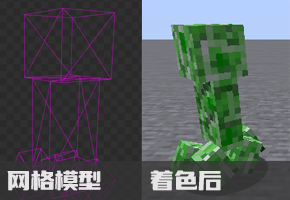
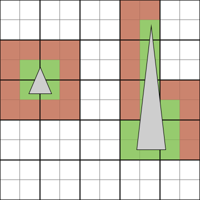

# 03. 基本概念

再进一步深入渲染前, 我们需要先探讨渲染中最关键的一些基本概念, 这部分会参杂部分来自 [LearnOpenGL](https://learnopengl.com) 的内容加上我自己的理解.
如果没有看懂我的讲解, 可以前往 LearnOpenGL 本站或其 [中文翻译站点](https://learnopengl-cn.github.io/) 深入了解.

## 1. 顶点, 图元, 片段

在渲染中, 顶点 (Vertex) 通常代表着三维或二维空间中的一个点. 是定义图元的基本结构, 储存着坐标, 贴图, 颜色等一系列基本组成图元并绘图所需的属性信息.

图元 (Primitive) 是由顶点连线相连组成的基本几何图形. 最基本也是最常用的图元是三角形 (Triangle). 我们渲染的物体通常是网格模型 (Mesh), 即由顶点组成的图元进一步组成的多面体.

片段 (Fragment) 则为图元内部由顶点连线内区域的像素, 片段可以被附上颜色. 这个过程称为着色 (Shading), 根据着色时提供的参数与顶点自身的属性信息将顶点组成的网格骨架覆盖上颜色.



## 2. 标准化设备坐标系

在将图元绘制到屏幕上前, 我们需要明确的一个问题是: "我给了一个顶点, 他会渲染在窗口的哪里?" 
此时就需要通过标 [准化设备坐标系](https://learnopengl-cn.github.io/01%20Getting%20started/04%20Hello%20Triangle/) (Normalized Device Coordinates, 以下简称NDC) 来确定给定坐标点在窗口中的位置.

NDC 是图形API定义的跨平台统一的二维坐标系, 范围为`[-1.0, 1.0]`. 其原点在窗口正中央, X 轴为水平轴, 正方向为向右; Y 轴为垂直轴, 
但与通常图像坐标系不同的是, **Y轴正方向为向上而非向下**.

下图来自 [LearnOpenGL CN](https://github.com/LearnOpenGL-CN/LearnOpenGL-CN/)


如图所示, 只要我们提供了 `(0.0, 0.5), (-0.5, -0.5), (0.5, -0.5)` 这三个顶点并作为三角形图元渲染, 我们就能在窗口正中央渲染一个三角形图元.
任何超过`[-1.0, 1.0]`范围的像素绘制都会被丢弃, 不会被绘制到屏幕上.

## 3. 渲染管线

通常, 我们需要渲染的物体都是在 3D 空间内, 但我们的屏幕是 2D 的 NDC 坐标系的, 我们要如何将我们需要渲染的物体从 3D 空间中转换并绘制到屏幕 2D 坐标系上, 并将其图元覆盖的像素进行着色? 

这便是 Blaze3D, 或者说其驱动的底层图形 API 的大部分工作. 图形 API 通过 "渲染管线" 驱动GPU高效地将原始的 3D 顶点数据进行转换, 并最终绘制到我们的屏幕窗口上.

下图来自 [LearnOpenGL CN](https://github.com/LearnOpenGL-CN/LearnOpenGL-CN/)


如图所示, 渲染管线将三维空间中的顶点数据作为输入, 经过顶点着色器 (Vertex Shader) 与几何着色器 (Geometry Shader) 的变换 (transform) 后得到最终显示在屏幕上图元的 NDC 坐标顶点.

这些顶点再经过图元装配 (Shape Assembly) 组装成图元, 发送给光栅化器 (Rasterizer) 得到图元所覆盖的像素, 并将像素发送给片段着色器 (Fragment Shader) 进行着色, 经过混合与测试后输出.

上图中蓝色的部分即为我们可以在渲染管线中自定义的部分, 我们将着重探讨顶点着色器与片段着色器, 几何着色器不在目前 Blaze3D 支持范围内, 且性能较差.

## 4. 着色器

渲染管线中可以自定义的部分全部都是着色器 (Shader), 但着色器究竟是什么呢? 这个小节中我们将从 GPU 最基本的硬件原理开始介绍着色器.

### 4.1 并行计算

传统的 CPU 模型中, 只有一个控制单元, 一个缓存数据单元, 和一个计算单元. 控制单元发出一条指令, 只能处理一次计算结果, 效率非常的低, 但渲染中我们需要处理成千上万的数据, 怎么样才能提高效率呢?

#### 4.1.1 单指令多数据

最先出现的解决方法是 [单指令多数据](https://en.wikipedia.org/wiki/Single_instruction,_multiple_data) (Single instruction, multiple data; SIMD).
它通过增加 CPU 的计算单元的数量, 使用专用多数据指令同时让多个计算单元对寄存器内地数据进行计算同时处理多数据.

下图来自 [Wikipedia](https://en.wikipedia.org/wiki/Single_instruction,_multiple_data)


但是, 这个方案有几个问题:
1. 我们需要手动读取数据并将其打包到专用寄存器中排列成多个计算单元能够同时读取的格式.
2. 即使我们打包的数据量小于寄存器最大支持的数量, 指令仍然会让所有计算单元都开始工作.
3. 我们无法对寄存器内不同的数据进行分支或复杂处理.
4. 我们一次指令只能执行简单的计算.

#### 4.1.2 单指令多线程

Nvidia 在其 G80 芯片中引入了一种新的架构, 名叫 [单指令多线程](https://en.wikipedia.org/wiki/Single_instruction,_multiple_threads) (Single instruction, multiple threads; SIMT).
他是 SIMD 的改进, 解决了以上问题, 是现代 GPU 架构的基础.

如果说 SIMD 是并行计算单元, 那 SIMT 就是在 SIMD 之上构建的一整套并行计算系统. SIMT 为 SIMD 中每个计算单元都分配了单独的寄存器, 访存单元, 缓存, 与调度器.

以下图片来自 Nvidia [Parallel Thread Execution ISA Version 9.2](https://docs.nvidia.com/cuda/parallel-thread-execution/).


将一个个只能执行一次简单数学运算的计算单元包装拓展成一个个在计算机模型上独立的虚拟逻辑处理器 (Processor) . 这些处理器上运行着支撑复杂运算逻辑的线程.

这些处理器没有自己独立的控制单元, 他们被分成组 (Multiprocessor, 下文简称SM) , 听从一个全局的指令单元 (Instruction Unit) 的指挥, 并行地执行同一条指令.

> [!NOTE]
> 从用户视角来看SIMT确实将计算单元包装扩展成了 "虚拟逻辑处理器" 这里的用词是 "分配" 和 "虚拟",
> 因为在 (Nvidia的) 硬件结构上, 计算单元, 寄存器, 与访存是 Multiprocessor 里全局共享,
> 而非每个线程独有的. 这些资源由调度器在执行中动态分配给每个线程, 组合成一个逻辑上完整的 "核心".

这带来了显著的改善:
1. 每个逻辑处理器都能各自读取内存或缓存中任意不同位置的数据运算, 不再需要将数据打包进寄存器.
2. 每个逻辑核心并行执行相同的单数据指令达到多数据并行, 能像**处理单数据一样编写代码**, 无需专用指令.
3. 对于不满足核心数量的计算任务, 多余的不完整核心可以直接被关闭, 节省资源和能耗.
4. 每个逻辑核心都能执行更复杂的运算任务得益于寄存器与缓存.

但是, 每个组只有一个指令单元指挥, 所有逻辑核心一次只能同时执行一种逻辑, 那 SIMT 是怎么解决 SIMD 不能执行分支的问题呢? 

得益于寄存器, 每个核心都能拥有自己的状态, 包括当前执行的分支. 控制单元能够根据状态找到所有执行同一分支的核心, 暂时关闭其他核心, 只执行这一条分支.

在一条分支结束后, 关闭这些已经运行完毕的分支的核心, 打开另一个分支的核心, 执行另一个分支. 如此往复直到所有分支执行完毕.

> [!TIP]
> 我们可以这样来理解: 有一个工厂, 里面有一堆机械臂, 他们被连接到了一个控制器上. 没有分支时, 所有机械臂一起工作.
> 如果我们遇到了分支, 需要一部分机械臂执行工作 A, 另一部分执行工作 B. 只能拔掉需要执行工作 B 的机械臂的电源线.
> 让所有需要执行工作 A 的机械臂先工作, 再把这批机械臂的电源线拔掉, 接上需要执行工作 B 的机械臂的电源线, 让所有
> 执行工作 B 的机械臂工作.

### 4.2. 顶点与片段着色器

现在我们已经知道如何使用 GPU 高效率并进行并行复杂计算了. 那么我们要如何为这些 GPU 逻辑核心编写程序, 又需要在哪些地方用到这些程序呢?

#### 4.2.1 顶点着色器

我们需要渲染模型, 将模型的顶点变换到 NDC 坐标系, 但模型通常不止有上述的三个顶点, 可能有几十, 乃至几百, 甚至成千上万个顶点, 无法高效地用 CPU 计算, 该怎么办呢?

顶点着色器就是为此而生的程序, 他是渲染管线第一个可自定义部分, 也是最重要的可自定义部分之一. 他的职责便是将 GPU 传入逻辑核心的顶点按照预先设定的程序指令进行变换.

下图来自 [GPUOpen](https://gpuopen.com/) 的文章  [From vertex shader to mesh shader](https://gpuopen.com/learn/mesh_shaders/mesh_shaders-from_vertex_shader_to_mesh_shader/)


GPU 把传入的所有顶点进行分组, 将每个组传递给不同的一个或多个 SM, SM 内所有逻辑处理器都运行着相同的顶点着色器, 每个逻辑处理器负责处理一个顶点.

> [!TIP]
> 关于 GPU 以何种规则进行的分组, 我目前只找到 AMD 对此的简要解释 (即上述文章), 原理为选取一段连续的, 特定长度内的,
> 且有足够数量 "重复" 顶点的一串顶点进行分组. 

#### 4.2.2. 片段着色器

我们传入的顶点经过了顶点着色器后进入了图元装配得到了图元, 图元光栅化后得到了需要着色的图元像素区域. 一个图元可能就有成千上万个像素, 我们要如何为他们高效地着色呢?

我们可以编写片段着色器程序进行着色. 他是渲染管线中另一个重要的自定义部分, 允许我们编写自己的逻辑为每个传入 GPU逻辑核心的像素高效地着色, 并传递给后续的测试与混合.

GPU 将光栅化后的像素进行分组, 将每个组传递给不同的一个或多个 SM, SM 内所有逻辑处理器运行着相同的片段着色器, 每个逻辑处理器负责处理一个像素.

> [!TIP]
> 关于光栅化, 现代GPU 的光栅化器通常是以 2x2 像素为最小单元 (Quad) 进行光栅化的, 不满 2x2 的部分 (比如斜边边角)
> 仍然按 2x2 补齐并 **全数执行** 片段着色器, 只是多出来的部分不会被渲染出来. 这也是后期重要的一个基本概念.
> 
> 
> 
> 如上图红色部分就是不会被渲染出来但也依旧按照 2x2 像素进行光栅化得到的像素.

## 5. 堆内存与堆外内存

我们已经了解了渲染最基本的原理, 但我们仍然有一个问题: "我要怎么把顶点交给 GPU 去处理?" 图形 API 主要通过传递内存指针 (Pointer) 的方式获取数据.

但是, 我们在 MOD 开发中使用的 Java, 并没有见到类似指针或是映射内存的东西. 这是因为, 我们操作的一切都不是原始的内存, 而是经过 JVM 进行管理后的堆内存 (On-Heap Memory).

### 5.1. 堆内存

堆内存如上所述, 是由 Java 虚拟机 (以下简称 JVM) 进行管理的内存, 完全由 JVM 负责分配与释放, 由 JVM 的垃圾收集器 (以下简称 GC) 定期进行内存回收.
我们常见的对象便是通常分配在堆内存中的.

```java
var obj = new Object(); // 他被分配在了堆内存中.
var arr = new Object[16]; // 他也被分配在了堆内存中.
```

堆内存可能会被 JVM 移动, 被 GC 回收, 他在内存中实际的地址 (即指针) 和可用性是**不确定**的. 因此在 Java 中我们无法获取堆内存的指针, 
那我们要怎么办才能将数据传递给图形 API 呢?

### 5.2. 堆外内存

对于上述问题, 我们可以使用堆外内存 (Off-Heap Memory) 解决. 与堆内存完全交给 JVM 与 GC进行管理相对的是, 堆外内存是完全由用户进行管理的.

因此无论是分配 (Allocate), 释放 (Free), 还是移动, 都是由我们亲自管控的, 我们需要这段内存的完全控制权, 因此我们是能拿到这段内存的地址 (Address) (即指针) 并向图形 API 传递数据的. 

但与此同时, 堆外内存缺乏了 JVM 与 GC 的自动管理, 因此我们需要手动管理这段内存, 确保在使用完毕后及时手动释放这段内存, 以免出现内存泄漏.

> [!IMPORTANT]
> 使用堆内存传递数据并非完全不可能, Blaze3D 所使用的底层库是允许使用堆内存数组传递**部分**数据的,
> 或者你可以使用 Unsafe 将堆内存数组对象中的数据复制到堆外内存中并传递给图形 API. 但我们**通常不这么做**.

### 5.3. 如何操作堆外内存

那么, 我们已经知道了使用堆外内存向图形 API 传递数据, 那我们该怎么操作堆外内存呢? 实际上 Java 和 Blaze3D 所使用的底层库 [LWJGL3](https://github.com/LWJGL/lwjgl3) 已经给出了几种不同的方法.

#### 5.3.1. ByteBuffer

我们可以使用 Java 1.4 后提供的 `java.nio.ByteBuffer` 来操作堆内存或堆外内存. ByteBuffer 对内存进行了包装, 使我们能够更加轻松的读写内存.

同时, LWJGL 绝大部分情况下允许使用操作堆外内存的 ByteBuffer 直接传入其包装的图形 API, LWJGL 会自行解析并提取其中的内存大小与内存地址, 十分方便.

##### 5.3.1.1. 基本结构

- `position`: 代表了 "下一次写入或读取的地址偏移 (Offset)", 初始为0, 会随着自增写入或读取不断自增长.
- `capacity`: 代表了 "这段内存有多大", 无法改变, 是阻止写入或读取溢出错误的关键.
- `limit`: 代表了 "我往这段内存里写了多少有效数据", 防止读取时读取到有效数据之外的内存.

##### 5.3.1.2. 常用方法

- `ByteBuffer.put*`: 向内存中写入对应的数值.
- `ByteBuffer.get*`: 从内存中读取对应的数值.
- `ByteBuffer.flip`: 将 limit 设置为 position, 并将 position 设为 0.

以下是常见数据类型的字节大小与写入/读取方法:

|   类型   | 字节数 |    写入方法     |    读取方法     |
|:------:|:---:|:-----------:|:-----------:|
|  byte  |  1  |    `put`    |    `get`    |
| short  |  2  | `putShort`  | `getShort`  |
|  int   |  4  |  `putInt`   |  `getInt`   |
| float  |  4  | `putFloat`  | `getFloat`  |
|  long  |  8  |  `putLong`  |  `getLong`  |
| double |  8  | `putDouble` | `getDouble` |

##### 5.3.1.3. 自增写入/读取

下面这段代码描述了如何使用 "自增写入/读取" 向 ByteBuffer 所包装的内存中写入或读取数据, 并展示了为何自增写入/读取需要 flip 才能让写入的数据被后续使用者正确读取到写入的数据.

```java
import java.nio.ByteBuffer;

ByteBuffer buf = ...; // 创建方法见下文
		
void foo() {
	// 向 buf 内连续写入(int) 15, (byte) 3, (int) 9.
    buf.putInt(15); // 写入地址 = 内存地址 + position = 内存地址 + 0; int 大小为 4 则 position += 4 即 4;
    buf.put((byte) 3); // 写入地址 = 内存地址 + position = 内存地址 + 4; int 大小为 1 则 position += 1 即 5;
    buf.putInt(9); // 写入地址 = 内存地址 + position = 内存地址 + 5; int 大小为 4 则 position += 4 即 9;
    buf.flip();  // 翻转这个 ByteBuffer, 设定 limit = position = 9, 代表我们写入了总共 9 byte的数据. 设置 position = 0; 下次读取 (getInt) 从 0 开始读;
    
    /*
    此时这段内存的样子:
    +------+---+---+---+---+----------+---+---+---+---+-----------+
    | byte | 0 | 1 | 2 | 3 | 4        | 5 | 6 | 7 | 8 | 9...      |
    +------+---+---+---+---+----------+---+---+---+---+-----------+
    | data | 15 (int)      | 3 (byte) | 9 (int)       | undefined |
    +------+---------------+----------+---------------+-----------+
    */
	
	var a = buf.getInt(); // 读取地址 = 内存地址 + position = 内存地址 + 0 读到 15; int 大小为 4 则 position += 4 即 4;
	var b = buf.get(); // 读取地址 = 内存地址 + position = 内存地址 + 4 读到 3; byte 大小为 1 则 position += 1 即 5;
	var c = buf.putInt(); // 读取地址 = 内存地址 + position = 内存地址 + 5 读到 9; int 大小为 4 则 position += 4 即 9;
    
    // 读取完之后 position == limit == 9, 我们刚好读取完了所有数据, 若再读下去超出有效范围则会报错.
}
```

##### 5.3.1.4 绝对偏移写入/读取

那么, 假设我们不想要依赖 position 定位的 "自增写入/读取", 而是需要在指定偏移进行写入或读取, 我们该怎么办呢? ByteBuffer 提供了对应写入与读取方法的重载, 即 "绝对偏移写入/读取".

```java
import java.nio.ByteBuffer;

ByteBuffer buf = ...; // 创建方法见下文
		
void foo() {
    buf.putInt(0, 15); // 向内存地址 + 0 byte 的位置写入一个值为 15 的 int.
	buf.put(5, (byte) 3); // 向内存地址 + 5 byte 的位置写入一个值为 3 的byte.
    buf.putFloat(8, 9.0f); // 向内存地址 + 8 byte 的位置写入一个值为 9.0f 的 float.
    
    /*
    此时这段内存的样子:
    +------+---+---+---+---+-----------+----------+-----+-----+---+---+----+----+
    | byte | 0 | 1 | 2 | 3 | 4         | 5        | 6   | 7   | 8 | 9 | 10 | 11 |
    +------+---+---+---+---+-----------+----------+-----+-----+---+---+----+----+
    | data | 15 (int)      | undefined | 3 (byte) | undefined | 9.0f (float)    |
    +------+---------------+-----------+----------+-----------+-----------------+
    */
	
	var a = buf.getInt(0); // 从内存地址 + 0 byte 的位置读取一个 int 的值, 读到 15.
	var b = buf.get(5); // 从内存地址 + 5 byte 的位置读取一个 byte 的值, 读到 3.
	var c = buf.putFloat(8); // 从内存地址 + 8 byte 的位置读取一个 float 的值, 读到 9.0f.
}
```

上述代码描述了如何使用 "绝对偏移写入/读取" 向 ByteBuffer 所包装的内存中的指定位置写入或读取数据. 此时我们不使用 position 进行定位, position 不会在写入或读取后自增.

因此, 我们不需要也不能使用 flip, 此时 position 为 0, 使用 flip 会认为 "这个 ByteBuffer 没有写入任何数据".

> [!NOTE]
> 如果要我用 ByteBuffer, 我个人更喜欢 "绝对偏移" 的写入/读取方式, 因为这种方式是 "无状态的",
> 我不需要去管什么 position, limit, 指哪打哪, 十分方便易懂.

#### 5.3.2. 如何使用 ByteBuffer

现在我们已经知道如何操作一个 ByteBuffer 来写入或读取内存数据了, 那么我们需要如何创建它并用其操作堆外内存呢? LWJGL 与 Java 1.4 后的 NIO 均提供了不同的创建方式.

##### 5.3.2.1. 字节序

在了解如何创建 ByteBuffer 前, 我们需要了解一个很重要的概念叫[字节序](https://zh.wikipedia.org/wiki/%E5%AD%97%E8%8A%82%E5%BA%8F) (Byte Order). 
字节序即为多字节数据类型的排列顺序. 字节序分为大端序 (Big Endian) 与 小端序 (Little Endian) 两种.

对于一个四字节的数据 `0xAA_BB_CC_DD`, 大端序和小端序的储存方式分别是:

| 地址偏移 |  0   |  1   |  2   |  3   |
|:----:|:----:|:----:|:----:|:----:|
| 小端序  | 0xDD | 0xCC | 0xBB | 0xAA |
| 大端序  | 0xAA | 0xBB | 0xCC | 0xDD |

- 大端序将最高位的字节 `0xAA` 储存在了最低位的地址偏移中, 其储存顺序类似十六进制字节从左到右的普遍阅读顺序. 
- 而小端序则是将最低位字节 `0xDD` 储存在了最低位的地址偏移中, 其储存顺序更接近计算机或数学本身对数字的逻辑定义.

JVM 默认使用大端序对数据进行储存, **而非本机原生的字节序**, 因此我们在创建 ByteBuffer 时需要注意, 防止数据传递给原生的图形API后因为字节序不同导致顺序错乱.

我们可以使用 `ByteOrder.nativeOrder()` 来获取本机原生的字节序, 并使用 `ByteBuffer.order(ByteOrder order)` 设置 ByteBuffer 的字节序.

##### 5.3.2.2. NIO 创建 ByteBuffer

我们可以使用 Java 1.4 后提供的 `java.nio.DirectByteBuffer` 来操作堆外内存. 但 LWJGL 强烈不推荐该方法. 本篇仅作为介绍, 不推荐实际使用该方法.

```java
var buf = ByteBuffer.allocateDirect(1024).order(ByteOrder.nativeOrder()); // 分配一个大小为 1024 字节的 DirectByteBuffer.
```

我们可以使用 `ByteBuffer` 类提供的静态方法 `allocateDirect(int capacity)` 来分配一个操作堆外内存的 `DirectByteBuffer` 并借此写入数据.
使用该方法创建的 ByteBuffer 无需手动释放堆外内存, JVM 可以进行自动管理.

这个方法看似简单好用, 但存在以下几项致命的缺点, 详见 [这篇教程](https://blog.lwjgl.org/memory-management-in-lwjgl-3/) 的 `Strategy #4`:
1. 使用该方法分配的 ByteBuffer 字节序为 JVM 默认的大端序, 需手动将其修改为本机原生的字节序防止数据顺序颠倒.
2. 使用该方法分配的堆外内存大小有限制 (`-XX:MaxDirectMemorySize`)
3. 使用该方法分配速度非常慢.
4. 我们在不使用特殊方法的情况下无法手动控制这段堆外内存的回收.
5. 自动回收需要 2 个 GC 周期才能回收堆外内存, 在大压力下十分容易导致内存溢出,
6. 分配的内存都默认填充了 0, 而未提供其他填充选项.

##### 5.3.2.3. LWJGL 创建 ByteBuffer

直接使用 NIO 创建 ByteBuffer 有那么多限制, LWJGl 还不推荐, 那我们该如何正确创建 ByteBuffer 呢? LWJGL 为我们提供了多种方法创建和管理 ByteBuffer.

首先, 最方便的方法是 `org.lwjgl.system.MemoryStack`, 它提供了一个可以像 C/C++ 一样在栈上分配内存体验的接口, 在作用域内自动帮我们管理堆外内存, 作用域外自动释放, 适合即用即弃的场景.

以下是 MemoryStack 常用的方法:

|                 方法                  |                         含义                          |
|:-----------------------------------:|:---------------------------------------------------:|
|      `MemoryStack.stackPush()`      |                  分配一个 MemoryStack                   |
|   `MemoryStack.malloc(int size)`    |         在给定MemoryStack中分配一段大小为 size 字节的堆外内存         |
|   `MemoryStack.calloc(int size)`    | 在给定MemoryStack中分配一段大小为 size 字节的堆外内存, 并确保这段内存所有字节都为0 |
| `MemoryStack.bytes(byte... values)` |       在给定MemoryStack中分配一段足够大小的内存, 内容为 values        |

以下代码展示了如何使用 MemoryStack 操作堆外内存: 

```java
import org.lwjgl.system.MemoryStack;

void foo() {
    // 分配一个 MemoryStack.
    try (var stack1 = MemoryStack.stackPush()) {
        // 这个 try-with-resources 是 stack1 的作用域
        
        // 分配一个大小为 8 byte 的堆外内存, 并确保其中所有字节为 0.
        var buf1 = stack1.calloc(8);
        
        // 在第一个 stack 作用域里再新分配一个 MemoryStack.
        try (var stack2 = MemoryStack.stackPush()) {
			// 分配一个大小为 16 byte 的堆外内存, 不保证其默认状态下内存内容.
			var buf2 =  stack2.malloc(16);
        }
        // 这里超出 stack2 的 try-with-resources 作用域, 自动执行 stack2.close(), 
        // 将我们在 stack2 中分配的内存 (buf2) 全部释放.
        // 但请注意, stack1 的作用域未结束, 因此 buf1 是安全的, 不会被释放掉.
    }
    // 这里超出 stack1 的 try-with-resources 作用域, 自动执行 stack.close(), 
    // 将我们在 stack1 作用域中分配的内存 （buf1) 全部释放.
}
```

但是, MemoryStack 只适用于较小的堆外内存分配, 因为其本质是一块预分配好的固定大小的堆外内存, 模拟真正栈内存的行为进行高速分配, 防止每次都调用真正分配方法造成开销.

对于想要分配更大的堆外内存, 可以使用 LWJGL 提供的另一种分配方法 `org.lwjgl.system.MemoryUtil`. MemoryUtil 提供了最原始的内存分配方法, 但也因此需要手动管理释放内存.

以下是 MemoryUtil 常用的方法:

|                  方法                  |                 含义                  |
|:------------------------------------:|:-----------------------------------:|
|    `MemoryUtil.memAlloc(int num)`    |         分配一段大小为 num 字节的堆外内存         |
|   `MemoryUtil.memCalloc(int num)`    | 分配一段大小为 num 字节的堆外内存, 并确保这段内存所有字节都为0 |
| `MemoryUtil.memFree(ByteBuffer ptr)` |           释放 ptr 所指向的堆外内存           |

以下代码展示了如何使用 MemoryUtil 操作堆外内存.

```java

import org.lwjgl.system.MemoryUtil;

void foo() {
    // 分配一个大小为 8 byte 的堆外内存, 并确保其中所有字节为 0.
    var buf = MemoryUtil.memCalloc(8);
    
    // 重要! 使用完一定要释放这段堆外内存.
    MemoryUtil.memFree(buf);
}
```

#### 5.3.3. 直接操作内存地址

除了使用 ByteBuffer, 我们还能使用直接操作内存地址这种最原始方式操作堆外内存, LWJGL 为 MemoryStack 和 MemoryUtil 都提供了直接操作内存地址的方法.

> [!NOTE]
> 对于我本人来说, 直接操作内存地址是我最喜欢的操作堆外内存的方式, 其次是自己写包装, 然后是 ByteBuffer.
> 因为内存地址只是一个 long 类型, 没有 Java 类型包装的开销, 也没有 ByteBuffer 的越界检查, 性能最好.

##### 5.3.3.1 创建与释放 

上文中介绍了 MemoryStack 中 ByteBuffer 版分配堆外内存的方法, 下面将介绍其内存地址版本变体:

|                           方法                            |                                          含义                                           |
|:-------------------------------------------------------:|:-------------------------------------------------------------------------------------:|
|             `MemoryStack.nmalloc(int size)`             |                          在给定MemoryStack中分配一段大小为 size 字节的堆外内存                          |
| `MemoryStack.ncalloc(int alignment, int num, int size)` | 在给定MemoryStack中分配一段大小为 num 个元素的内存, 每个元素有 size 字节大, 且保证地址为 alignment 倍数, 且内存中所有字节内容为 0 |
|             `MemoryStack.nbyte(byte value)`             |                      在给定MemoryStack中分配一个 byte 大小的堆外内存, 内容为 value                      |

以下代码展示了如何使用MemoryStack 的内存地址版本方法变体创建堆外内存.

```java
import org.lwjgl.system.MemoryStack;

void foo() {
    // 分配一个 MemoryStack.
    try (var stack1 = MemoryStack.stackPush()) {
        // 这个 try-with-resources 是 stack1 的作用域
        
        // 分配一个大小为 8 byte 的堆外内存.
        long ptr = stack1.nmalloc(8);
    }
    // 这里超出 stack1 的 try-with-resources 作用域, 自动执行 stack.close(), 
    // 将我们在 stack1 作用域中分配的内存 （ptr) 全部释放.
}
```

MemoryUtil 同样提供了对应方法的内存地址版本变体:

|                      方法                      |                         含义                         |
|:--------------------------------------------:|:--------------------------------------------------:|
|      `MemoryUtil.nmemAlloc(long size)`       |                分配一段大小为 num 字节的堆外内存                 |
| `MemoryUtil.nmemCalloc(long num, long size)` | 分配一段大小为 num 个元素的内存, 每个元素有 size 字节大, 并确保这段内存所有字节都为0 |
|       `MemoryUtil.nmemFree(long ptr)`        |                  释放 ptr 所指向的堆外内存                   |

以下代码展示了如何使用 MemoryUtil 的内存地址方法变体创建和释放堆外内存.

```java
import org.lwjgl.system.MemoryUtil;

void foo() {
    // 分配一个大小为 8 byte 的堆外内存, 并确保其中所有字节为 0.
    long ptr = MemoryUtil.memCalloc(8);
    
    // 重要! 使用完一定要释放这段堆外内存.
    MemoryUtil.nmemFree(ptr);
}
```

##### 5.3.3.2 写入与读取

我们现在知道了如何分配最原始的堆外内存地址, 但是, 只有地址我们应当如何写入和读取内存中的数据呢? MemoryUtil 提供了对原始内存地址的写入与读取方法:

|   类型   |           写入方法            |           读取方法            |
|:------:|:-------------------------:|:-------------------------:|
|  byte  |  `MemoryUtil.memPutByte`  |  `MemoryUtil.memGetByte`  |
| short  | `MemoryUtil.memPutShort`  | `MemoryUtil.memGetShort`  |
|  int   |  `MemoryUtil.memPutInt`   |  `MemoryUtil.memGetInt`   |
| float  | `MemoryUtil.memPutFloat`  | `MemoryUtil.memGetFloat`  |
|  long  |  `MemoryUtil.memPutLong`  |  `MemoryUtil.memGetLong`  |
| double | `MemoryUtil.memPutDouble` | `MemoryUtil.memGetDouble` |

这些方法通过提供一个 `long prt` 参数, 在指定内存地址上写入或去读取对应类型的数据, 下面这段代码展示了如何使用 MemoryUtil 提供的写入/读取方法直接才做堆外内存地址:

```java
import org.lwjgl.system.MemoryUtil;

void foo() {
    // 分配一个大小为 8 byte 的堆外内存, 并确保其中所有字节为 0.
    long ptr = MemoryUtil.memCalloc(8);

    MemoryUtil.memPutInt(ptr + 0, 9876); // 向内存地址 + 0 byte 的位置写入一个值为 15 的 int.
    MemoryUtil.memPutByte(ptr + 5, (byte) 44); // 向内存地址 + 5 byte 的位置写入一个值为 3 的byte.
    MemoryUtil.memPutFloat(ptr + 8, 15.0f); // 向内存地址 + 8 byte 的位置写入一个值为 9.0f 的 float.
    
    /*
    此时这段内存的样子:
    +------+---+---+---+---+-----------+-----------+-----+-----+---+---+----+----+
    | byte | 0 | 1 | 2 | 3 | 4         | 5         | 6   | 7   | 8 | 9 | 10 | 11 |
    +------+---+---+---+---+-----------+-----------+-----+-----+---+---+----+----+
    | data | 9876 (int)    | 0         | 44 (byte) | 0   | 0   | 15.0f (float)   |
    +------+---------------+-----------+-----------+-----------+-----------------+
    */

    var a = MemoryUtil.memGetInt(ptr + 0); // 从内存地址 + 0 byte 的位置读取一个 int 的值, 读到 9876.
    var b = MemoryUtil.memGetByte(ptr + 5); // 从内存地址 + 5 byte 的位置读取一个 byte 的值, 读到 44.
    var c = MemoryUtil.memGetFloat(ptr + 8); // 从内存地址 + 8 byte 的位置读取一个 float 的值, 读到 15.0f.

    // 重要! 使用完一定要释放这段堆外内存.
    MemoryUtil.nmemFree(ptr);
}
```

这类方法使用的是**绝对内存地址**写入而非 ByteBuffer 的偏移地址, 因此需要在写入时特别注意不要漏掉堆外内存本身的地址, 导致写入到不该写入的地方, 造成游戏崩溃.

## 6. 总结

至此, 你已全部了解完学习在 Java 中渲染所需要的所有基本概念, 可以继续回到代码中学习如何使用 Blaze3D. 这些基本概念将会在后期被反复提及并使用.