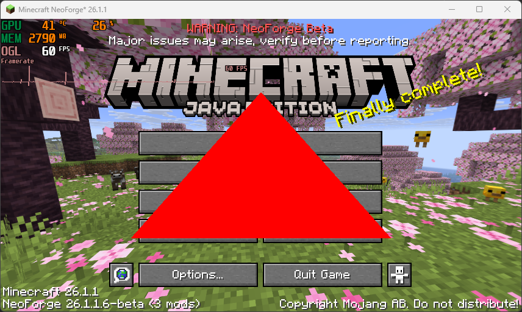
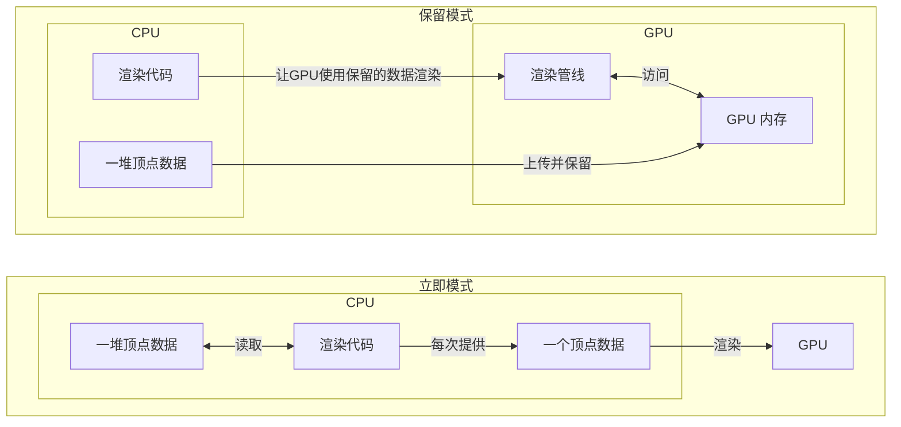
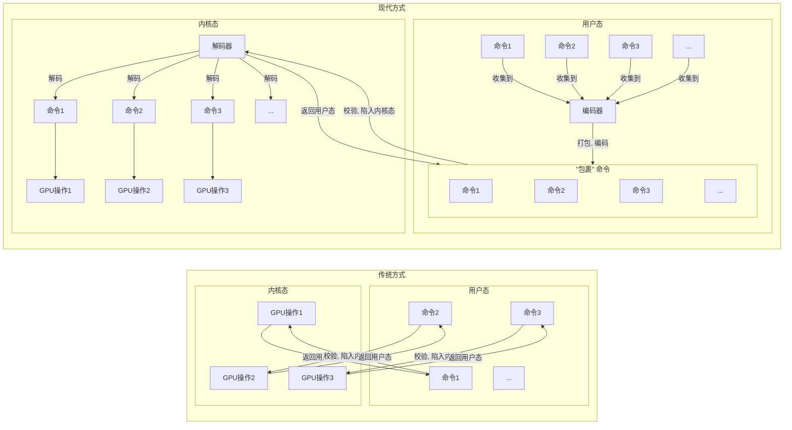
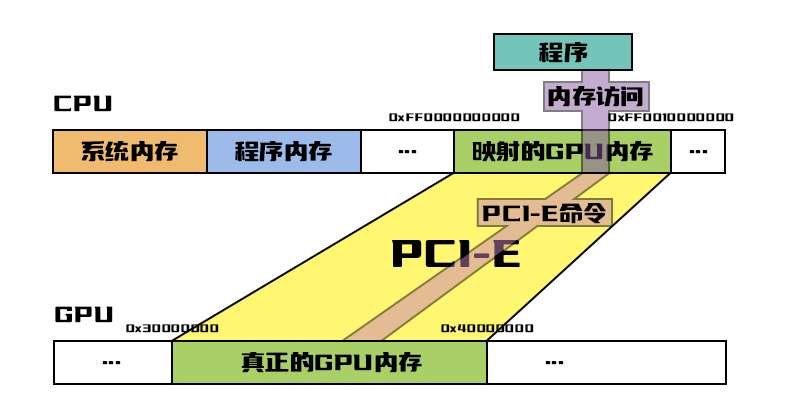

# 04. 第一个三角形

现在我们已经了解完了所有渲染所需要的基本概念. 现在我们终于可以回到代码上来, 绘制我们在屏幕上的第一个三角形了. 在本章中我们将一步步分小章节, 从零开始在 Minecraft 游戏界面上渲染出一个三角形, 
如下图所示.



# 04.1 GPU内存

## 1. GPU 内存

在以前, 我们每渲染一个顶点, 都要向 GPU 提交数据, GPU 用完就把他给丢掉了. 就像我们去交代工作, **每一步操作**都得跑过去告诉他们 "按着这个步骤去做". 
这种渲染的方式叫做 [立即模式](https://en.wikipedia.org/wiki/Immediate_mode_(computer_graphics)) (Immediate Mode).

你可以发现这样沟通效率非常非常低. 每次渲染我们都得向 GPU 传递数据, 非常非常的慢, 这要怎么办呢? [保留模式](https://en.wikipedia.org/wiki/Retained_mode) (Retained Mode) 就是为了解决这个问题而生的, 
也是现代渲染中最常使用的模式.



从上图中我们可以看到, 保留模式与立即模式最大的区别是, 保留模式把我们需要绘制的数据提前上传到了 GPU 中并保留起来. 这样每次执行渲染时, 
我们只需要告诉 GPU 用它自己内存里保存的某段数据进行渲染, 不需要再上传数据.

就拿交代工作为例子, 我们只需把工作步骤整理在一起成一套方案, 跑一趟放过去让他们保管好. 以后我们再需要交代工作, 只需要打个电话说 "按上次那套方案执行" 就能完事.

> [!TIP]
> 如果你想从原理上理解为什么立即模式这么慢:
> 我们 GPU 的驱动为了能够与我们的 GPU 硬件沟通, 他是工作在内核态的, 而我们的程序是工作在用户态的.如果用户态的程序要向内核态的驱动发送数据,
> 必须要**陷入一次内核态**, 切换内核态的操作很费时. 立即模式每次提交一个顶点, 导致指令很多也很零散, 进而导致会陷入很多次内核态, 拖慢速度.
> 而且不止这个, 每次提交数据的指令都要经过校验, 防止非法值炸掉驱动. 立即模式那么多指令会触发非常非常多次校验, 拖慢速度.

## 2. 申请一块 GPU 内存

GPU 内存也不是你想用就能用的, 我们的操作系统, 正在播放的视频, 后台其他的程序, 都有可能占据着一块 GPU 内存. 要是随随便便就写入的话, 其他程序会出错的. 
那我们该怎么办呢?

我们可以向我们的 GPU 设备申请一片 GPU 内存专门给我们自己使用, 不会和其他程序或系统冲突. 那我们要怎么申请呢?

### 2.1. GPU设备 (GpuDevice)

Blaze3D 提供了一个接口 `com.mojang.blaze3d.systems.GpuDevice`. 这个接口封装了所有与 GPU 相关的操作. 我们可以通过这个接口向 GPU 申请一段 GPU 内存, 
那我们要如何获取到这个 GpuDevice 呢?

以下代码可以在 `src/main/java/.../chapter04/mixins/GameRendererMixin.java` 找到.

```java
import com.mojang.blaze3d.systems.RenderSystem;

public static GpuDevice device; // 我们所有对 GPU 的操作都需要经过 GpuDevice (GPU 设备).

// 在 GameRenderer 初始化时调用, 用于初始化各种渲染资源, 仅调用一次.
public static void setup() {
    LOGGER.info("LearnBlaze3D正在初始化.");

    // 获取到我们渲染需要用到的的 GPU 设备.
    device = RenderSystem.getDevice();
}
```

从上述代码可以看到, 我们可以通过 `RenderSystem.getDevice()` 获取到游戏的 GpuDevice. 那么我们要通过什么方法来操作 GpuDevice 为我们申请一片 GPU 内存呢?

```java
import com.mojang.blaze3d.systems.RenderSystem;
import com.mojang.blaze3d.buffers.GpuBuffer;

public static GpuDevice device; // 我们所有对 GPU 的操作都需要经过 GpuDevice (GPU 设备).
public static GpuBuffer buffer; // 我们申请的 GPU 内存.

// 在 GameRenderer 初始化时调用, 用于初始化各种渲染资源, 仅调用一次.
public static void setup() {
    LOGGER.info("LearnBlaze3D正在初始化.");

    // 获取到我们渲染需要用到的的 GPU 设备.
    device = RenderSystem.getDevice();
    
	// 申请一片 GPU 内存.
    buffer = device.createBuffer(
            () -> "A piece of GPU memory",  // label (标签): 这片 GPU 内存的名字.
            GpuBuffer.USAGE_UNIFORM | GpuBuffer.USAGE_MAP_WRITE, // usage (用途): 这片内存能被用来做什么.
            36 // size (大小): 我们要申请的 GPU 内存的大小, 以字节为单位.
    );
}
```

我们可以使用 `GpuDevice.createBuffer(Supplier<String> label, int usage, long size)` 来申请一片被包装为 `com.mojang.blaze3d.buffers.GpuBuffer` 的 GPU 内存. 

GpuBuffer 封装了大部分我们能直接对 GPU 内存进行的操作, 常用方法如下:

|                     方法                      |       返回值        |                   含义                    |
|:-------------------------------------------:|:----------------:|:---------------------------------------:|
|             `GpuBuffer.size()`              |      `long`      |             返回这段 GPU 内存的大小              |
|             `GpuBuffer.usage()`             |      `int`       |             返回这段 GPU 内存的用途              |
|             `GpuBuffer.slice()`             | `GpuBufferSlice` | 返回一个代表了整段内存的 GPU 内存切片 (GpuBufferSlice)  |
| `GpuBuffer.slice(long offset, long length)` | `GpuBufferSlice` | 返回一个代表了这段内存从 offset 个字节开始长度为 length 的切片 |
|             `GpuBuffer.close()`             |      `void`      |               释放这段 GPU 内存               |

从 `GpuBuffer.close()` 我们不难发现, GPU 内存与堆外内存一样, **是需要我们手动管理的**. GPU 并不像 JVM 那样, GPU 不知道我们何时会丢弃这段内存.

```java
import com.mojang.blaze3d.buffers.GpuBuffer;

public static GpuBuffer buffer; // 我们申请的 GPU 内存.

// ...

// 在 GameRenderer 终止 (如关闭游戏) 时调用, 用来清理各种渲染资源, 仅调用一次.
public static void close() {
    LOGGER.info("LearnBlaze3D正在进行清理.");
    
    // 释放我们申请的 GPU 内存.
    buffer.close();
}
```

因此我们需要使用 `GpuBuffer.close()` 手动告诉 GPU 我们不要这段内存了, 将这段内存的控制权从我们自己手上归还给 GPU, 让其他程序或我们的下一次分配也能使用这段内存, 防止 GPU 存溢出.

> [!TIP]
> 如果我们一直不释放旧分配的内存并一直分配新的 GPU 内存, 那么很快 GPU 内存就会被耗尽. 程序会运行错乱或崩溃. 严重情况下 (但不多见) **会影响到其他程序的运行**.

除了 `close()` 外, 在上述申请 GPU 内存的代码和 GpuBuffer 的封装方法中, 仍然有两个未知的概念: 
1. "GPU 内存切片" 是什么? 它的作用是什么?
2. "GPU 内存的用途" 是什么, 他为什么是一个整型, 又怎么计算出对应用途的整型数呢?

### 2.2. GPU 内存切片 (GpuBufferSlice)

我们在向 GPU 内存传递或操作数据时, GPU 不仅需要知道写入哪片内存, 还要知道具体要写入到这篇内存的哪个区域, 我们要如何描述这个区域呢? 
`com.mojang.blaze3d.buffers.GpuBufferSlice` 可以帮助我们描述 GPU 内存的特定区域.

GpuBufferSlice 拥有三个字段:
- `GpuBuffer buffer`: 代表了这个区域具体指向哪片 GPU 内存.
- `long offset`: 代表了这个区域从这片 GPU 内存起点的第几个字节开始.
- `long length`: 代表了这个区域的长度是多少.

由这三个参数 GPU 就可以知道, 描述的区域是在 `buffer` 的 `[offset, offset + length)` 这片区间. GpuBufferSlice 同时也可以再细分, 通过 
`GpuBufferSlice.slice(long offset, size)` 从一片切片里再分出新的切片.

```java
import com.mojang.blaze3d.buffers.GpuBuffer;

GpuBuffer buffer = ...; // 假设这是一片长度为 10 的 GPU 内存。

void foo() {
    /*
    这片内存的样子:
    +---+---+---+---+---+---+---+---+---+---+
    | 0 | 1 | 2 | 3 | 4 | 5 | 6 | 7 | 8 | 9 |
    +---+---+---+---+---+---+---+---+---+---+
    |<---------------slice1---------------->|
            |<-----slice2------>|
                |<-slice3-->|
    */
	
    // 代表了这片 GPU 内存从头到尾完整的范围, 即 [0, size) 区间.
    var slice1 = buffer.slice();
    
    // 代表了这片 GPU 内存第 2 个字节开始的, 长度为 5 字节的范围, 即 [2, 2 + 5) == [2, 7) 区间.
    var slice2 = buffer.slice(2, 5);
    
    // 代表了从 slice2 描述的区间 [2, 7) 中第 1 个字节开始, 长度为 3 字节的范围, 即 [2 + 1, 2 + 1 + 3) = [3, 6) 区间.
    var slice3 = slice2.slice(1, 3);
}
```

上述代码描述了如何从 GpuBuffer 和 GpuBufferSlice 创建新的 GpuBufferSlice, 以及展示对应切片所描述 GPU 内存的范围.

> [!IMPORTANT]
> GpuBufferSlice 并没有申请一片新的内存, 他只是对已申请的一片 GPU 内存中的一片区域范围的 **描述**.

### 2.3. GPU 内存用途 (Usage)

GPU 内存与 CPU 内存不一样. CPU 的内存是通用的, 拿来干什么都没问题, 而 GPU 内存则是特化的, 有专门储存图像, 可以使用特定压缩算法的图像内存, 
也有专门进行数据交换或者储存顶点的内存.

每一种内存都走着完全不同的数据路径, 连接着不同的缓存, 应用着不同的压缩算法和内存排布. 因此我们必须要明确我们的内存需要被拿来做什么工作, 
GPU 才好从这些不同的内存类型中分配出适合我们需求的内存.

#### 2.3.1 标志位/位标志 (Flag Bit / Bit Flags)

通常我们想要描述某种功能的集合, 我们可能会用以下的代码:

```java
import java.util.Set;

class Functions {

    boolean function1;
    boolean function2;
    boolean function3;
    // ...
}
// 或者是:
class Functions {
    Set<Function> functions;

    enum Function {
        FUNCTION1,
        FUNCTION2,
        FUNCTION3,
        // ...
    }
}
```

这样确实能满足我们的需求, 但是他们都是基于对象的, 开销有点大, 在高频使用的场景可能会遇到很多小对象创建开销, 让 GC 负担变大. 那有没有什么办法解决这个问题呢?

我们可以注意到, `boolean` 只有 `true` 和 `false`, 是二元状态, 可以用**一个比特**来表示, 根本没必要浪费这么多对象的空间. 我们可以把多个比特捆在一起, 
那这是什么呢? **二进制表达的整型数字**.

比方说, 我们可以这么定义:
- 一个整型数字的第 0 个比特若为 1, 则功能 1 在这个集合中, 若未 0, 则该功能不再这个集合中.
- 一个整型数字的第 1 个比特若为 1, 则功能 2 在这个集合中, 若未 0, 则该功能不再这个集合中.
- 一个整型数字的第 2 个比特若为 1, 则功能 A 在这个集合中, 若未 0, 则该功能不再这个集合中.
- 一个整型数字的第 3 个比特若为 1, 则功能 B 在这个集合中, 若未 0, 则该功能不再这个集合中.
- ...

在这个定义下, 如果我们有一个数字 6, 二进制 `0b0110`, 我们可以得知:

|   比特   |  0   |  1   |  2   |  3   | ... |
|:------:|:----:|:----:|:----:|:----:|:---:|
|   数值   |  0   |  1   |  1   |  0   | ... |
|   功能   | 功能 1 | 供能 2 | 功能 A | 功能 B | ... |
| 是否在集合中 |  不在  |  在   |  在   |  不在  | ... |

我们能肉眼看出来二进制数字的某一位是否为 1, 那对于计算机要如何得知一个整型数 `a` 哪一位具体为 1, 以判断具体的功能是否应该在集合中呢? 
我们可以用 [按位与](https://en.wikipedia.org/wiki/Bitwise_operation#AND) (Bitwise AND) 来获取某一位具体的值.

我们只需要构造一个只在第 N 位为 1 的二进制整型 `var b = 1 << N;` 并将其与 `a` 按位或, 能得到:
- 因 `b` 的除了第 N 位外的比特全部为 0, 所以无论 `a` 的除 N 位外比特是 1 还是 0, 对应位的按位与结果都是 0. 
- 若 `a` 的第 N 位比特为 0, 根据按位与规则, 0 和 1 得到的结果为 0, 其他位也是 0, 得出 `a & b` 的结果就是 0.
- 若 `a` 的第 N 位比特为 1, 根据按位与规则, 1 和 1 得到的结果是 1, 而其他位是 0, 得出 `a & b` 将是一个非 0 整型数.

因此我们只需要判断 `(a & b) != 0` 为 `true` 即可得知第 N 位的比特为 1, 进而推导出对应位的功能在这个集合中.

我们现在可以统一一下 `a` 与 `b` 的名称:
- `b`: 代表了一项功能的 "标志位" (Flag Bit).
- `a`: 代表了功能集合的, 由零个到多个位标志组成的 "位标志" (Bit Flags).

> [!TIP]
> 如果不了解按位与这个操作, 可以先来了解 "与" (AND) 的规则: 
> - 当左操作数与右操作数都为 false 时, 返回 false.
> - 当左操作数为 true, 右操作数为 false 时, 返回 false.
> - 当左操作数为 false, 右操作数为 true 时, 返回 false.
> - 当左操作数与右操作数都为 true 时, 返回 true.
> 
> 按位与就是把整型数看成二进制, 对 `a` 与 `b` 的比特一一对应的比特看作 boolean, 进行与运算, 将结果写进输出数的对应比特中.
>
> |  比特   |     0      |     1      |     2     |     3      | ... |
> |:-----:|:----------:|:----------:|:---------:|:----------:|:---:|
> | 操作数 A |     0      |     1      |     0     |     1      | ... |
> | 操作数 B |     1      |     1      |     0     |     0      | ... |
> |  与运算  | 0 & 1 == 0 | 1 & 1 == 1 | 0 & 0 = 0 | 1 & 0 == 0 | ... |
> |  输出数  |     0      |     1      |     0     |     0      | ... |

现在我们知道了如何从位标志中读取标志位, 判断集合中是否有对应的功能, 那么我们该如何从标志位构建一个位标志功能集合呢? 
我们可以用另一个位操作 [按位或](https://en.wikipedia.org/wiki/Bitwise_operation#OR) (Bitwise OR) 来实现.

我们只需要将标志位 `var a = 1 << 5;` 与标志位 `var b = 1 << 3;` 进行按位或, 就能得到:
- 因 `a` 的第三位比特为 0, `b` 的第三位比特为 1, 得出输出数的第三位比特的按位或结果为 1.
- 因 `a` 的第五位比特为 1, `b` 的第五位比特为 0, 得出输出数的第五位比特的按位或结果为 1.
- 因 `a` 和 `b` 除了第三位与第五位外的所有位的比特全部为 0, 得出输出数对应比特的按位或结果为 0.

因此我们只需要执行 `a | b` 就能得到了一个在第三位与第五位比特为 1, 其他位比特为 0 的位标志. 同理, 如果有三个标志位 `a, b, c`, 我们也能通过
`a | b | c` 得到同时存在 `a, b, c` 这三个标志位的位标志.

> [!TIP]
> 如果不了解按或与这个操作, 可以先来了解 "或" (OR) 的规则:
> - 当左操作数与右操作数都为 false 时, 返回 false.
> - 当左操作数为 true, 右操作数为 false 时, 返回 true.
> - 当左操作数为 false, 右操作数为 true 时, 返回 true.
> - 当左操作数与右操作数都为 true 时, 返回 true.
>
> 按位与就是把整型数看成二进制, 对 `a` 与 `b` 的比特一一对应的比特看作 boolean, 进行或运算, 将结果写进输出数的对应比特中.
>
> |  比特   |      0      |      1      |      2      |      3      | ... |
> |:-----:|:-----------:|:-----------:|:-----------:|:-----------:|:---:|
> | 操作数 A |      0      |      1      |      0      |      1      | ... |
> | 操作数 B |      1      |      1      |      0      |      0      | ... |
> |  与运算  | 0 \| 1 == 1 | 1 \| 1 == 1 | 0 \| 0 == 0 | 1 \| 0 == 1 | ... |
> |  输出数  |      1      |      1      |      0      |      1      | ... |

#### 2.3.2. GpuBuffer.Usage

了解完标志位与位标志后, 我们意识到, GpuBuffer 的 usage 正是一种位标志, 用来表示 GPU 内存用途的集合. GpuBuffer 内提供了多个标志位常量供我们选择:

|                 标志位常量                  |           含义            |
|:--------------------------------------:|:-----------------------:|
|       `GpuBuffer.USAGE_MAP_READ`       |   这段内存可以被映射到 CPU 进行读取   |
|      `GpuBuffer.USAGE_MAP_WRITE`       |   这段内存可以被映射到 CPU 进行写入   |
| `GpuBuffer.USAGE_HINT_CLIENT_STORAGE`  |     这段内存可能会被存放到 CPU     |
|       `GpuBuffer.USAGE_COPY_DST`       | 可以将其他内存的内容复制到这片 GPU 内存里 |
|       `GpuBuffer.USAGE_COPY_SRC`       | 可以将这片内存的内容复制到其他 GPU 内存里 |
|        `GpuBuffer.USAGE_VERTEX`        |      这段内存可以被用来储存顶点      |
|        `GpuBuffer.USAGE_INDEX`         |     这段内存可以用来储存顶点索引      |
|       `GpuBuffer.USAGE_UNIFORM`        |   这段内存可以用来储存 Uniform    |
| `GpuBuffer.USAGE_UNIFORM_TEXEL_BUFFER` |     这段内存可以用来储存 UTB      |

我们现在还暂时不需要了解这些含义, 我们会在之后用到时进行详细的解释. 现在只需要知道它们是标志位, 我们可以通过类似 
`GpuBuffer.USAGE_VERTEX | GpuBuffer.USAGE_COPY_DEST` 的方式组合出 GpuBuffer 所能识别的 GPU 内存用途.

#### 2.3.2.1. ...我全都要!

不行, 你不能把全部 usage 都加上申请一片 "万能的" GPU 内存. GPU 上并没有这种万能内存. 就算你成功申请了, CPU/GPU 也几乎没有办法把任何优化应用到这片内存上.
会导致使用这片内存的 **渲染效率极其低下**. 请 **按需分配**.

## 3. 操作 GPU 内存.

现在我们已经了解了如何通过 Blaze3D 向 GPU 申请一块 GPU 内存了, 那么我们要如何使用 Blaze3D 操作我们申请好的内存, 向它写入我们需要的数据呢?

### 3.1. 命令开销

我们并不能直接通过 GpuDevice 类去命令 GPU, 这是为什么呢? 

正如开头所述, 在传统的旧图形 API 中, 每向 GPU 发送一次命令都会有开销. 为了解决这个问题, 一个拦在 GPU 与程序之间的 "管制员" 应运而生.
它拦截发往 GPU 的命令, 将他们打包编码在一起, 变成一个包裹一次性发送出去.



这便是现代图形 API 最常见的设计, 通常被叫做 "命令缓冲区" (Command Buffer) 或 "命令列表" (Command List). 在 Blaze3D 中, 他叫 "命令编码器".
我们将 GPU 命令发送给他, 他负责打包这些命令并高效地发送给 GPU.

> [!NOTE]
> 其实对于 Blaze3D 的 OpenGL 后端来说并不存在什么编码与打包, 全都是立即执行, 因为 OpenGL 即使是最新的版本也没有提供这样的功能. 
> 只有 Nvidia 提供的 [扩展](https://github.com/nvpro-samples/gl_commandlist_basic) 支持类似的操作, 但十分有限.
> 
> 但我们不需要为此担忧, 26.2 及以后的 Vulkan 后端则是实打实用的 Vulkan 命令缓冲区 (Vulkan Command Buffer), 性能提升明显, 开销大幅度降低. 

### 3.2. 获取命令编码器

```java
import com.mojang.blaze3d.systems.RenderSystem;
import com.mojang.blaze3d.buffers.GpuBuffer;
import com.mojang.blaze3d.systems.CommandEncoder;

public static GpuDevice device; // 我们所有对 GPU 的操作都需要经过 GpuDevice (GPU 设备).
public static GpuBuffer buffer; // 我们申请的 GPU 内存.
public static CommandEncoder commandEncoder; // 我们对 GPU 发号施令的命令编码器.

// 在 GameRenderer 初始化时调用, 用于初始化各种渲染资源, 仅调用一次.
public static void setup() {
    LOGGER.info("LearnBlaze3D正在初始化.");
    
    // ...
    // 通过 GPU 设备获取命令编码器.
    commandEncoder = device.createCommandEncoder();
}
```

以上代码描述了可以通过 GPU 设备, 使用 `GpuDevice.createCommandEncoder()` 获取到命令编码器 (`com.mojang.blaze3d.systems.CommandEncoder`).

通过调用 CommandEncoder 封装的方法, 我们便能够高效且便捷地向 GPU 发送命令操作 GPU.

> [!NOTE]
> 如果有人在此之前学过 [WebGPU](https://developer.mozilla.org/zh-CN/docs/Web/API/WebGPU_API) 或 [wgpu](https://github.com/gfx-rs/wgpu), 那么你们看到这可能会有点眼熟甚至有点既视感.
> 是的你没想错, Blaze3D 确实很像 WebGPU, 二者在很多命名和操作逻辑上都很相似.

> "所有的图形 API 都在某种程度上趋向统一, 至少在底层上是如此 😄"
>
> —— [**Dinnerbone**](https://minecraft.wiki/w/Dinnerbone)，Mojang 开发者
>
> *原文: "All the APIs are somewhat converging, at least on the basic levels like that 😄"*

### 3.3. 映射读取/写入

我们获取到了命令编码器后, 要如何命令 GPU 将数据写入 GPU 内存呢? CommandEncoder 封装了两种操作数据的方式, 我们先来了解第一种方式: "映射读取/写入".

#### 3.3.1. 内存映射IO (Memory-Mapped IO)

现代的 64 位处理器, 最少能处理 48 位的内存地址, 可以最高支持到 256 TB 的内存. 但我们绝大多数情况内存甚至都不会超过 128 GB, 
剩下的那么多高位内存地址有什么用呢? 

CPU 将 PCI-E 上连接的其他设备上的内存, **映射** 到这些永远用不到的内存地址上. 比如我们访问一个 `0xFF0000000002` 的高位地址, 
CPU 会自动把对它的访问转换为对 GPU 上 `0x30000002` 这个地址的访问.

> [!TIP]
> 如果你不了解"映射" (Mapping) 在内存里这个这个概念, 可以这么想: 你在操作一台手术机器人远程手术, 病人在千里之外 (GPU). 而你只需要操作近在咫尺的操作杆 (操作映射内存),
> 就能让千里之外的手术机器人的机械臂 (GPU 内存) 按照相同的动作行动起来 (做出相同改的内存操作).



如上图所示, GPU 内存看起来 "就像在主机内存里一样" 被分配到了一个地址段, 在我们看起来 **就像一片堆外内存一样**, 当我们尝试访问它时, CPU 会将我们的内存访问请求 **转换成 PCI-E 命令** 去操作真正的 GPU 内存.

这个机制就是内存映射IO (Memory-Mapped IO, MMIO), 它允许程序 **绕过设备驱动** 使用原生访存指令高效快速简便地直接通过访存指令直接访问到其他设备 (如 GPU) 的内存, 
避免驱动接管写入造成大量开销, 是映射写入的最基本原理之一.

> [!IMPORTANT]
> 这是非常非常简化的模型, 实际上中间还存在很多机制, 比如基地址寄存器 (Base Address Registers, BAR), 和写合并. 并非每条对映射内存的操作都会被转换成 PCI-E 命令.
> 在现代处理器中, 多条内存操作会被集合打包到一起, 组成一个大的 PCI-E 命令送往设备以规避 PCI-E 协议的固定开销. (就像命令编码器一样)

#### 3.3.2. 申请内存映射

那么, 既然我们已经知道了映射写入的核心原理是内存映射, 那么我们要怎么通过 Blaze3D 申请映射我们的 GPU 内存呢?

```java
import com.mojang.blaze3d.systems.RenderSystem;
import com.mojang.blaze3d.buffers.GpuBuffer;
import com.mojang.blaze3d.systems.CommandEncoder;
import org.lwjgl.system.MemoryUtil;

public static GpuDevice device; // 我们所有对 GPU 的操作都需要经过 GpuDevice (GPU 设备).
public static GpuBuffer buffer; // 我们申请的 GPU 内存.
public static CommandEncoder commandEncoder; // 我们对 GPU 发号施令的命令编码器.

// 在 GameRenderer 初始化时调用, 用于初始化各种渲染资源, 仅调用一次.
public static void setup() {
    // ...

    // 命令 GPU 驱动映射我们的 **整片** GPU 内存 buffer 至 CPU 进行 **写入**.
    try (var mapped = encoder.mapBuffer(buffer, false, true)) {
        // 获取到被映射到的堆外内存地址 (以 ByteBuffer 的形式)
        var byteBuf = mapped.data();
        // 当然你确实可以获取到真正的映射内存地址..
        var address = MemoryUtil.memAddress0(byteBuf);

        // 向这个堆外内存地址写入数据, 写入操作会自动映射/反映到 GPU 内存上, 我们的 GPU 内存做出了同样的写入.
        byteBuf.putInt(0, 114);
        byteBuf.putInt(4, 514);
        byteBuf.putInt(8, 1919);
        byteBuf.putInt(12, 810);
    }
    // 出了作用域, try-with-resources 执行了close之后, mapped 就失效了, 不要再用它.
	
    // 告诉 GPU 我们要下一次映射的范围是从 buffer 这片内存的头开始数的第 16 个字节开始, 长度为 12 字节的范围.
    var range = buffer.slice(16, 12);
    
    // 命令 GPU 映射我们的 GPU 内存 buffer 的从第 16 个字节开始, 长度为 12 字节这个范围的内存至 CPU 进行 **写入**.
    try (var mapped = encoder.mapBuffer(range, false, true)) {
        // 获取到被映射到的堆外内存地址 (以 ByteBuffer 的形式)
        var byteBuf2 = mapped.data();
        // 我们可以获取这段被映射内存的大小, 可以发现 capacity 是 12.
        var capacity = byteBuf2.capacity(); // == 12
        
        // 往这片被映射的内存开头 (0) 写入数据, 会自动反映到我们 GPU 内存开头的第 16 个字节.
		byteBuf2.putInt(0, 233);
    }
}
```

> [!TIP]
> 如果你到了这里还是没能理解为什么 `byteBuf2.putInt(0, 233);` 是在往 GPU 内存开头的第 16 个字节写入. 你可以这样想, 你在看一本书. 你的视线没动,
> 但书往左移动了 16 个字符 (切片的偏移是 16 字节). 你即使没有移动你的视线 (仍然在 0 处写入), 你看到的 (写入的) 仍然是书本的第 16 个字.
> 你已经在一个 "移动后" 的环境里, 不需要自己走 16 byte 才能在第 16 byte 写入数据.

上述代码描述了我们可以操作 CommandEncoder, 使用 `CommandEncoder.mapBuffer` 的两个方法重载来命令 GPU 为我们的 GPU 内存申请映射. 其两个重载及参数如下:

|                                      方法                                       |          返回值           |              含义              | 
|:-----------------------------------------------------------------------------:|:----------------------:|:----------------------------:|
|   `CommandEncoder.mapBuffer(GpuBuffer buffer, boolean read, boolean write)`   | `GpuBuffer.MappedView` |    映射 **整片** GPU 内存到 CPU     |
| `CommandEncoder.mapBuffer(GpuBufferSlice slice, boolean read, boolean write)` | `GpuBuffer.MappedView` | 映射 一片 GPU 内存的 **指定区域** 到 CPU |

其两个方法重载的各项参数含义如下:

|    参数    |        类型        |                     含义                     |
|:--------:|:----------------:|:------------------------------------------:|
| `buffer` |   `GpuBuffer`    |               需要被映射的 GPU 内存                |
| `slice`  | `GpuBufferSlice` |                 需要被映射的内存区域                 |
|  `read`  |    `boolean`     | 若为 `true`, 则这片被映射的内存可以被用来读取数据, 反之则不可用于读取数据 |
| `write`  |    `boolean`     | 若为 `true`, 则这片被映射的内存可以用来写入数据, 反之则不可用于写入数据  |

从上表可以看到, mapBuffer 有两个重要的参数 `read` 和 `write` 来表明被映射的内存 "可以被用于做什么". 为什么我们不能随心所欲地操作映射内存, 
而是需要用参数指定 "这片映射内存能被用于做什么呢"? 

这是因为 CPU 通常会给指令执行做各种各样的优化, 比如乱序执行, 写入合并, 或者读取缓存. 但这些优化只能在 **特定条件下** 正常工作, 比如你当然不会希望你读取映射内存时读取到的不是最新的显存内容,
而是来自 CPU 缓存的旧内容吧? 所以这时 CPU 就可以根据你的需求来开启或关闭特定的优化, 保证你的内存访问高效且正常地工作.

#### 3.3.3. GpuBuffer.MappedView

了解完了 mapBuffer 的参数, 现在来看一下它返回的 `com.mojang.blaze3d.buffers.GpuBuffer$MappedView`, 即我们申请的映射到 CPU 上的的 GPU 内存.

其提供的方法如下:

|          方法          |     返回值      |            含义            | 
|:--------------------:|:------------:|:------------------------:|
| `MappedView.data()`  | `ByteBuffer` | 返回以 ByteBuffer 包装的映射内存地址 |
| `MappedView.close()` |    `void`    |         停止映射这段内存         |

正如我们之前提供的代码那样, 我们可以使用 `data()` 方法获取到以 ByteBuffer 封装的映射内存地址, 对其进行数据读写. 同时其实现的 `AutoClosable` 
所提供的 `close()` 方法表明它需要在使用完成后手动停止映射, 或使用 `try-with-resources`.

> [!NOTE]
> 需要手动释放的原因其实不难理解, 内存映射本身也是要占用 CPU 资源与内存地址资源, 如果一直占着茅坑不拉屎那么所有资源都会很快耗尽导致程序崩溃.
> 但其实最重要的原因是: 旧版本的 OpenGL 为了防止某些意外发生, 是 **不允许被映射的 GPU 内存参与渲染的**, 为了维持这个旧版本 OpenGL 兼容性, 
> Blaze3D 才要求所有被映射的内存写入完后都要象征性地停止映射映射内存. 至于真的有没有停止映射, 则由后端自行决定.

#### 3.3.4. USAGE_MAP_READ / USAGE_MAP_WRITE

你应该能注意到, 映射读取/写入似乎与我们之前提到的其中两个申请 GPU 内存时的提到的其中两个 usage, `USAGE_MAP_READ` 与 `USAGE_MAP_WRITE` 有关.
是的, 这两个 usage 正是给映射读取/写入使用的. 

如果我们希望我们的 GPU 内存能够被映射到 CPU **读取**, 那么我们需要将 `USAGE_MAP_READ` 加入到 usage 标志位中. 如果如我们之前的例子一样, 希望对映射内存进行 **写入**,
则需要将 `USAGE_MAP_WRITE` 加入到 usage 标志位中:

```java
import com.mojang.blaze3d.systems.RenderSystem;
import com.mojang.blaze3d.buffers.GpuBuffer;
import com.mojang.blaze3d.systems.CommandEncoder;

public static GpuDevice device; // 我们所有对 GPU 的操作都需要经过 GpuDevice (GPU 设备).
public static GpuBuffer buffer; // 我们申请的 GPU 内存.
public static CommandEncoder commandEncoder; // 我们对 GPU 发号施令的命令编码器.

// 在 GameRenderer 初始化时调用, 用于初始化各种渲染资源, 仅调用一次.
public static void setup() {
    // ...
    
    // 申请我们用来存放数据的 GPU 内存.
    buffer = device.createBuffer(
            () -> "Name of the memory", 
            GpuBuffer.USAGE_MAP_WRITE, // 使用 USAGE_MAP_WRITE 告诉 GPU 设备我们需要这片内存可以被映射到 CPU 进行写入.
            1024
    );
	
    // ...
}
```

### 3.4. 历史包袱.

既然这种方式这么好用, 为什么还需要有另一种写入方式呢? 这就不得不提到关于 MMIO 的历史包袱了. 在计算机普遍只有 32 位, 最多只能寻址 4GB 内存的年代. 
MMIO 为了保证有足够的内存可以让所有 PCI 外设都能接入进来, 限制了每个外设 **最多只能映射 256MB 的内存到 CPU**.

那如果我想映射超过 256MB 的 GPU 内存到 CPU 该怎么办呢? 通常有两种方式:

#### 3.4.1. 重映射

假设我们需要映射 512MB 的 GPU 内存进行写入, 我们先只映射前 256MB 的内存到 GPU 上. 当我们写入到超出 256MB 的区域时, CPU 会替我们覆盖掉之前映射的配置,
将映射的内存范围调整后 256MB 的 GPU 内存.

#### 3.4.2. CPU内存

这是目前主流的方案. 假设我们申请了一段超过 256MB 的 GPU 内存, 且它可能被用于映射内存操作, 那么驱动为了避免重映射开销问题, **会直接选择把内存分配在 CPU 上** 
让 GPU 每次读取都走 PCI-E 访问.

#### 3.4.3. 权衡利弊

|  方案   |                 优点                  |                 缺点                  | 
|:-----:|:-----------------------------------:|:-----------------------------------:|
|  重映射  |  你写入的数据是真真切切存在 GPU 上的, GPU 后续读取极快   |      每次超出范围都需要覆盖重新映射, 导致写入开销极大      |
| CPU内存 | 你相当于直接在 CPU 内存中写入, 写入速度极快不需要走 PCI-E | GPU 每次读取都要走 PCI-E, 读取速度要慢 **至少好几倍** |

可以看到两个方案都各有其利弊, 但 **无一例外他们都会导致性能下降**. 就没有能够处理大批量数据搬运的方法了吗?

#### 3.4.4. 复制引擎

为了解决这个问题, GPU 内置了一个专门的设备 "复制引擎" (Copy Engine). 它就像一台专门用于搬运的起重机, 负责从 CPU 大规模拉取数据并上传至真正的 GPU 内存. **专门用于大批量的数据传输**.

那我们要怎么才能使用复制引擎来将数据写入 GPU 内存呢?

> [!NOTE]
> 其实现代硬件还有方法: 可变大小的基地址寄存器 (Resizable Base Address Registers, Resizable-BAR). 传统的基地址处理器 (BAR) 只允许 256MB 的映射大小,
> 但 Resizable-BAR 允许几乎把整个 GPU 内存都映射到 CPU 内存地址来, **几乎没有重映射开销**. 但并非所有人都有这种现代硬件.

### 3.5. 复制写入

这就要提到 Blaze3D 提供的第二个内存写入方法了: "复制写入". 命令编码器封装了对复制引擎的调用, 只需要准备好一段待复制的堆外内存, 传递给命令编码器, 就能将大量数据一同传输至 GPU 内存中.

#### 3.5.1. 那我能不能...

既然复制引擎的效率那么高, 那我能不能用复制写入代替映射内存写入, 用来进行大量且频繁的小数据量的数据上传呢? **不能!** 正如我之前说的那样, 复制引擎像一台起重机,
**它本身就有着巨大的启动开销** (起重机也得耗油啊). 你要是用起重机把一张纸从一楼吊到二楼, 那油钱贵的还不如自己走楼梯 (映射内存操作).

#### 3.5.2. 使用复制写入

```java
import com.mojang.blaze3d.systems.RenderSystem;
import com.mojang.blaze3d.buffers.GpuBuffer;
import com.mojang.blaze3d.systems.CommandEncoder;

public static GpuDevice device; // 我们所有对 GPU 的操作都需要经过 GpuDevice (GPU 设备).
public static GpuBuffer buffer; // 我们申请的 GPU 内存.
public static CommandEncoder commandEncoder; // 我们对 GPU 发号施令的命令编码器.

// 在 GameRenderer 初始化时调用, 用于初始化各种渲染资源, 仅调用一次.
public static void setup() {
    // ...
    
    // 某一块我们已经写好的堆外内存数据, 大小小于或等于 10 字节.
    ByteBuffer offHeapBuffer = ...;
	
    // 告诉 GPU 我们要写入的范围是从 buffer 这片内存的头开始数的第五个字节开始, 长度为 10 字节的范围.
    var range = buffer.slice(5, 10);
    
    // 使用命令编码器向 GPU 提交一个命令, 把 offHeapBuffer 的数据写入到 buffer 这片内存的目标范围里.
    commandEncoder.writeToBuffer(range, offHeapBuffer);
}
```

上述代码描述了使用 `CommandEncoder.writeToBuffer(GpuBufferSlice destination, ByteBuffer data)` 来将 `data` 
写入到 `destination` 指定的 GPU 内存范围里.

从名字不难看出, 它将数据 **复制** 进了目标的 GPU 内存. 因此我们的目标内存需要支持 "数据被复制到这片内存里" 这个用途, 即 `GpuBuffer.USAGE_COPY_DST`.
我们需要将它加入到 usage 位标志中:

```java
import com.mojang.blaze3d.systems.RenderSystem;
import com.mojang.blaze3d.buffers.GpuBuffer;
import com.mojang.blaze3d.systems.CommandEncoder;

public static GpuDevice device; // 我们所有对 GPU 的操作都需要经过 GpuDevice (GPU 设备).
public static GpuBuffer buffer; // 我们申请的 GPU 内存.
public static CommandEncoder commandEncoder; // 我们对 GPU 发号施令的命令编码器.

// 在 GameRenderer 初始化时调用, 用于初始化各种渲染资源, 仅调用一次.
public static void setup() {
    // ...
    
    // 申请我们用来存放数据的 GPU 内存.
    buffer = device.createBuffer(
            () -> "Name of the memory", 
            GpuBuffer.USAGE_COPY_DST, // 使用 USAGE_COPY_DEST 告诉 GPU 设备我们需要这片内存来接受被复制过来的数据.
            1024
    );
	
    // ...
}
```

> [!IMPORTANT]
> 如果你以前稍微了解过 OpenGL, 翻看 GLCommandEncoder 发现 writeToBuffer 的 OpenGL 实现是 `glBufferSubData`.
> 请不要认为它和 glBufferSubData一样. 在 Vulkan 后端它中是 **不保证正在读写的数据不被复制写入干扰的**. 
> 永远不要在 GPU 正在使用这片内存时更新这片数据!